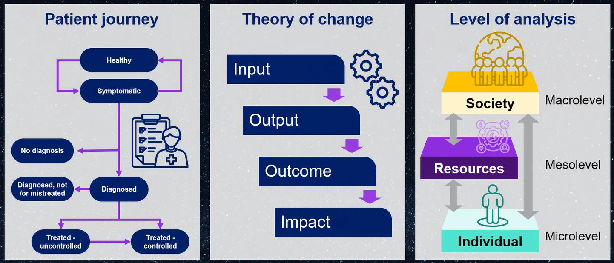

# elevateHealth
elevateHealth Open Science community

Code and data for
- modeling & simulation of patient journeys, including early stages of disease (before a person is called a patient)
- other methodologies and tools used by the elevatehealth community, e.g. impact valuation, Theory of Change (connecting inputs, outputs, outcomes and impact)
- our human-centric approach considers a) patients who have a diagnosis, b) those with specific disease progression risks who are not yet patients, c) human beings who take care of others including healthcare professionals but also informal carers.

See updates on our LinkedIn group at https://www.linkedin.com/groups/14503169/

The code and data in this GitHub repo are about our first use case, in chronic urticaria, a skin disease. See these publications:
- https://pubmed.ncbi.nlm.nih.gov/38441370/ Maurer et al. (2024) Modelling of patient journey in chronic spontaneous urticaria: Increasing awareness and education by shorten patients' disease journey in Germany.
- https://pubmed.ncbi.nlm.nih.gov/38733261/ Augustin et al. (2024) The socio-economic burden of H1-antihistamine-refractory chronic spontaneous urticaria in Germany

When installing the code and reproducing the patient journey modeling in the above papers, we recommend to start with the R code, then other code. 

Contacts for this GitHub repo: 
- Michael Rebhan, https://www.linkedin.com/in/michael-rebhan-b022751/
- Petra Nathan, https://www.linkedin.com/in/dr-petra-nathan-ba939929/

Do join us via the LinkedIn group to contribute to new cases where we apply the elevateHealth framework, and our Open Science community, as explained in this figure and posts in our LinkedIn group.

