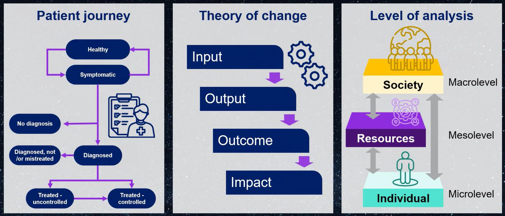

# elevateHealth
elevateHealth Open Science community

Code and data for
- modeling & simulation of patient journeys, including early stages of disease (before a person is called a patient in classic healthcare systems)
- other methodologies and tools used by the elevatehealth community, e.g. impact valuation, Theory of Change (connecting inputs, outputs, outcomes and impact, i.e. IOOI modeling)
- our human-centric approach considers a) patients who have a diagnosis, b) those with specific disease progression risks who are not yet patients, c) human beings who take care of others including healthcare professionals but also informal carers.

See updates on our LinkedIn group at https://www.linkedin.com/groups/14503169/

The code and data in this GitHub repo are about our first use case, in chronic urticaria, a skin disease. See these publications:
- https://pubmed.ncbi.nlm.nih.gov/38441370/ Maurer et al. (2024) Modelling of patient journey in chronic spontaneous urticaria: Increasing awareness and education by shorten patients' disease journey in Germany.
- https://pubmed.ncbi.nlm.nih.gov/38733261/ Augustin et al. (2024) The socio-economic burden of H1-antihistamine-refractory chronic spontaneous urticaria in Germany

When installing the code and reproducing the patient journey modeling in the above papers, we recommend to start with the R code, then other code. 

At https://github.com/lenka-arcondis/elevateHealth you can find code from Arcondis that is based on our cardiovascular disease (CVD) code from Daniel Meier (Swiss Re, https://www.linkedin.com/in/daniel-meier-phd-saa/). See Gabriela's post (https://lnkd.in/p/efhv3A6B). 

Contact for this GitHub repo: 
- Michael Rebhan, https://www.linkedin.com/in/michael-rebhan-b022751/

Do join us via the LinkedIn group to contribute to new cases where we apply the elevateHealth framework, and our Open Science community, as explained in this figure and posts in our LinkedIn group.

In this figure you can see the high-level picture of the framework we are building, originally based on patient journey modeling (left panel) using 'health states' (https://pubmed.ncbi.nlm.nih.gov/28529704/), the IOOI frame (center panel) and the desire to understand different kinds of value and impact including patient value (at individual level) but also societal value, e.g. building on PALY in addition to QALY and DALY (https://pubmed.ncbi.nlm.nih.gov/40999102/) and also resources e.g. manpower shortages in healthcare systems.
