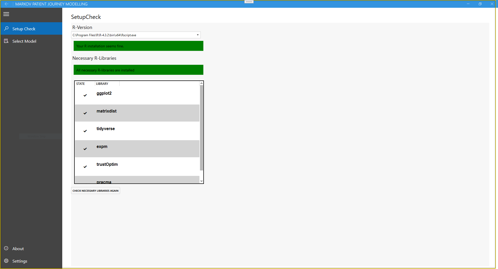
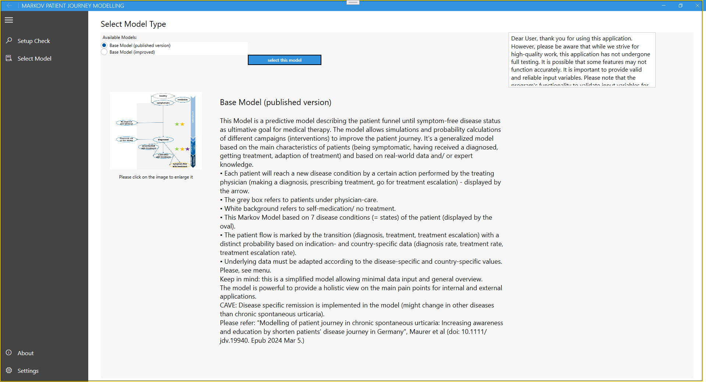

# Markov Patient Journey Modelling

## About the application

This Patient Journey Model User Interface is an intuitive code designed to efficiently visualize and analyze patient journeys. This interface seamlessly incorporates a Markov model, allowing users to present and calculate various aspects of the patient flow and simulate the effects of different interventions.

Through this user-friendly interface, everyone can effortlessly analyze the progression of patients through different states and healthcare processes according to their country- and indication-specific needs. The Markov model, a probabilistic model, enhances data-driven decision-making by capturing patient movement between states and estimating future outcomes based on the input variables.

By inputting interventions, such as campaigns to improve diagnosis rate or awareness programs for patients, users can simulate the impact on patient flow. The interface then generates comprehensive visualizations, facilitating the exploration of different scenarios and identifying potential areas for improvement.

This powerful tool not only aids in understanding patient journeys but also supports evidence-based decision-making. From optimizing resource allocation to identifying bottlenecks in care processes, the Markov Model User Interface provides healthcare professionals with a dynamic platform to effectively assess and improve patient flow.

## About the model

This Model is a predictive model describing the patient flow of patients with chronic diseases from onset of symptoms until symptom-control under medical therapy. It allows simulations and probability calculations of different campaigns (interventions) to improve the patient journey. In this regard, the model can support decision making. It’s a generalized and simplified model based on the clinically important events of patients (being symptomatic, having received a diagnosed, getting treatment, effect of the treatment).  Each patient can only be within one disease condition at one time (e.g. either symptomatic OR diagnosed) - the states are mutual exclusive. The patient will reach a new disease condition by a certain action performed by the treating physician (making a diagnosis, prescribing treatment, go for treatment escalation) - displayed by the arrow.  It is also possible, that the patient is moving ‘backwards’ to one step before (e.g. the patient is ‘uncontrolled with treatment’ - thus, he will consult his physician for other medication (state ‘diagnosed’) - which than will result in a specific disease outcome (e.g. ‘controlled with treatment’). The patient also can stay within one state.

The model allows simulation of interventions on the patient flow with regards to patient outcomes in a quantitative manner (on population level) and qualitatively by illustrating the course of time (diagnosis time, treatment time, etc).

### Description of the figure/ symbols
The grey box refers to patients under physician-care. White background refers to self-medication/ no physician-based treatment. The model is based on 7 disease conditions (= states) of the patient (displayed by the oval). The patient flow is marked by the transition (diagnosis, treatment, treatment escalation) with a distinct probability based on indication- and country-specific data (diagnosis rate, treatment rate, treatment escalation rate). 

### Advanced information

This Markov model is part of decision-analytical models without memory. Meaning, each state is only dependent on the directly state before. To discriminate between different treatments and treatment outcomes a decision tree is underlying (see section... for specific information).  Underlying ‘rate’ is the general  probability to move from one state to another (e.g. diagnosis rate). Whereas the ‘probability’ is the rate over time (e.g. probability to go from symptomatic to diagnosed within one week).

Cave: Disease specific remission is implemented in the model (might change in other diseases than chronic spontaneous urticaria).

### Please, take care of

Underlying data must be adapted according to the disease-specific and country-specific values. Please, see menu
Keep in mind: this is a simplified model allowing minimal data input and general overview. 

### Please refer

*Modelling of patient journey in chronic spontaneous urticaria: Increasing awareness and education by shorten patients' disease journey in Germany*
Marcus Maurer, Matthias Augustin, Sabine Bauer, Swarna Ekanayake-Bohlig, Philipp Kircher, Anja Knöll, Thomas Kramps, Hjalmar Kurzen, Sonja Laemmel, Natalija Novak, Eva Oppel, Lal Pirouzmandi, Michael Rebhan, Ulrich Reimnitz, Grit Richter-Huhn, Beate Schwarz, Uwe Schwichtenberg, Petra Staubach, Christian Termeer, Antje Thielen, Katarina Varga, Dagmar von Bubnoff, Alexander Zink, Benjamin Gmeiner, Petra Nathan (doi: [10.1111/jdv.19940](https://doi.org/10.1111/jdv.19940). Epub 2024 Mar 5.)

This application was developed by GABO GmbH: Rüdiger Voigt, Wolfgang Irlinger

## Usage

### Setup Check

This application generates R code. To run it, you need to select an installed version of R. This page then checks if all necessary R libraries are installed. If that is not the case, please install those before running the application.

### Select Model

On this page you select the model you would like to run. 

### Project Description

To provide a comprehensive overview, please include the project title, author, and a concise description including the indication, country of use, and data source. If the project is a pilot or test case, kindly mention it in the description field for clarity.

You will find those information later in the ReadMe file in the output folder.

The fields “title” and “authors” are necessary. Once you entered that information and moved to the next input the next pages will be activated.

### Setup Pages

Within these windows, you have the flexibility to specify the effects you wish to simulate on your patient journey. The default values have been pre-set based on the Chronic Spontaneous Urticaria (CSU) model in Germany, which can be found in the provided reference.

### Run Simulation / Results

On this page you can start the simulation. First it will you ask for the folder you want to store the results in. Then this will write the necessary R code (with the parameters you provided before) and then run it. This might take some minutes.

This page shows you a preview of the results. With a click on the button below the images you open the result folder. It contains the generated code, input data used and the output in form of data and graphs.
